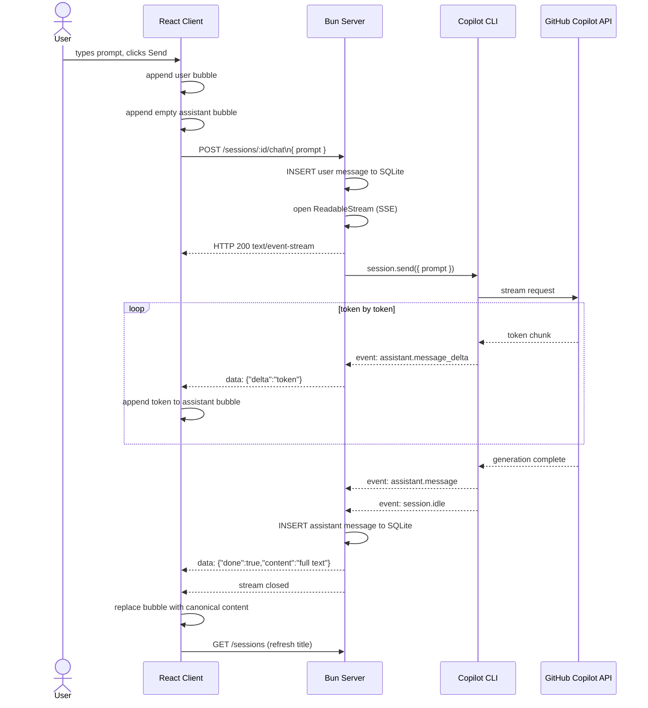

[toc]

# copilot-apple

A self-hosted GitHub Copilot chat service with a persistent REST API backend and a React web client. One shared Copilot CLI subprocess handles all conversations, keeping RAM usage low.


## TODO

- [ ] build Agent has system prompt and LLM model, now build: tools, memory, MCP
  - actually we have Agent SDK, our task is to use services and control Agent Fleet
- [ ] thinking -> show tools, what agent doing...
- [ ] format code in chat response
- [ ] db should use seed/migrate, separate service like PocketBase -> restart or build Docker will not lose prev data
- [ ] A2A agent to agent communication, or build a agent manager
- [ ] refer to claw-banana to have Telegram Chatbot
- [x] stream chat response — SSE streaming implemented (see [Streaming Chat](#streaming-chat))

## Changelog

### Streaming Chat (SSE)

Replaced the blocking `sendAndWait` + single JSON response with a **Server-Sent Events (SSE) stream** so the UI renders the reply word-by-word as it arrives.

**Server changes (`server/`)**
- `copilot.ts` — added `streaming: true` when resuming existing sessions on boot.
- `routes/sessions.ts` — `POST /sessions/:id/chat` no longer awaits the full reply.
  - A `ReadableStream` is opened and returned immediately with `Content-Type: text/event-stream`.
  - Subscribes to the Copilot session's event emitter:
    - `assistant.message_delta` → sends `data: {"delta":"<token>"}` for every incoming token.
    - `assistant.message` → captures the final authoritative content.
    - `session.idle` → persists the full message to SQLite, sends `data: {"done":true,"content":"..."}`, then closes the stream.
    - `session.error` → sends `data: {"error":"..."}` and closes the stream.
  - User message and session title are written to SQLite **before** the stream is opened (no await needed).

**Client changes (`client/src/components/ChatTab.tsx`)**
- `send()` pre-inserts an empty assistant message bubble immediately.
- Reads `Response.body` via `ReadableStream` + `TextDecoder`, accumulating a line buffer.
- Parses each `data: ...` SSE line:
  - `{delta}` → appends token to the live assistant bubble.
  - `{done, content}` → replaces bubble content with the server's canonical text; refreshes session list.
  - `{error}` → writes the error into the bubble.

## Streaming Chat



## Architecture

### Development (`bun run dev`)

```
Browser (localhost:4002)
        │  HTTP REST  (API_BASE = http://localhost:4001)
        ▼
  Bun client — client/  (localhost:4002)   static SPA
  Bun server — server/  (localhost:4001)   REST API
        │  JSON-RPC stdio
        ▼
  Copilot CLI subprocess  ← started once, shared forever
        │  HTTPS
        ▼
  GitHub Copilot API
```

### Production (`docker compose up`)

```
Browser (host:4000)
        │
        ▼
   nginx  (port 4000 → 80)
     │  location /sessions, /agents, /models, /health
     │─────────────────────────────► server container (port 4001)
     │                                      │  JSON-RPC stdio
     │  location /                          ▼
     └────────────────────────────► client container (port 4002)
                                    Copilot CLI subprocess
                                           │  HTTPS
                                           ▼
                                    GitHub Copilot API
```

## Project structure

```
copilot-apple/
├── package.json              # Bun workspace root
├── server/
│   ├── index.ts              # Entry point — Bun.serve + route wiring
│   ├── db.ts                 # Database init, migrations, prepared statements
│   ├── helpers.ts            # CORS headers, json(), preflight, randomId()
│   ├── copilot.ts            # CopilotClient boot + in-memory session Map
│   ├── routes/
│   │   ├── models.ts         # GET /models
│   │   ├── agents.ts         # CRUD /agents, /agents/:id
│   │   └── sessions.ts       # CRUD /sessions, chat & messages
│   ├── sessions.db           # SQLite — persisted sessions & messages
│   └── .env                  # GITHUB_TOKEN, PORT
└── client/
    ├── index.ts              # Bun static server
    ├── index.html
    └── src/
        ├── main.tsx
        ├── App.tsx           # Root layout — chat tab + agents tab
        ├── types.ts          # Shared TypeScript types
        ├── index.css
        └── components/
            ├── SessionSidebar.tsx
            ├── ChatTab.tsx
            ├── ChatMessages.tsx
            ├── ChatInputBar.tsx
            ├── AgentsTab.tsx
            ├── AgentCard.tsx
            ├── AgentForm.tsx
            └── AgentPickerModal.tsx
```

## Getting started

### 1. Install dependencies

```bash
bun install
```

### 2. Set your GitHub token

Edit `server/.env`:

```env
GITHUB_TOKEN=your_token_here
PORT=4001
```

### 3. Run both server and client

```bash
bun run dev
```

Or run separately:

```bash
bun run dev:server   # API on http://localhost:4001
bun run dev:client   # UI  on http://localhost:4002
```

## Features

- **Persistent sessions** — conversations are saved to SQLite (`sessions.db`) and survive server restarts
- **Session resume** — on boot the server reconnects to all previous Copilot sessions via `resumeSession()`
- **Session history** — full message history per conversation, accessible via the sidebar
- **Auto title** — session title is set from the first message you send
- **Single subprocess** — one Copilot CLI process shared across all sessions; new sessions are lightweight RPC calls
- **CORS enabled** — client on a different port can freely call the API

## REST API

| Method   | Endpoint                 | Description                                    |
| -------- | ------------------------ | ---------------------------------------------- |
| `GET`    | `/sessions`              | List all sessions                              |
| `POST`   | `/sessions`              | Create a new session                           |
| `GET`    | `/sessions/:id/messages` | Full message history for a session             |
| `POST`   | `/sessions/:id/chat`     | `{ "prompt": "..." }` → SSE stream of `{delta}` / `{done, content}` / `{error}` events |
| `DELETE` | `/sessions/:id`          | Abort and delete a session                     |
| `GET`    | `/health`                | Server status + active session count           |

## Deployment (Docker / Raspberry Pi)

```bash
# Set your token
echo "GITHUB_TOKEN=your_token_here" > .env

# Build and start all services
docker compose up -d --build
# App is available at http://<host>:4000
```

Services started by Docker Compose:

| Container | Internal port | Role                          |
| --------- | ------------- | ----------------------------- |
| `nginx`   | 4000 (host)   | Reverse proxy — entry point   |
| `client`  | 4002          | Bun static SPA server         |
| `server`  | 4001          | REST API + Copilot subprocess |

SQLite data is persisted in a named Docker volume (`server-data`).
