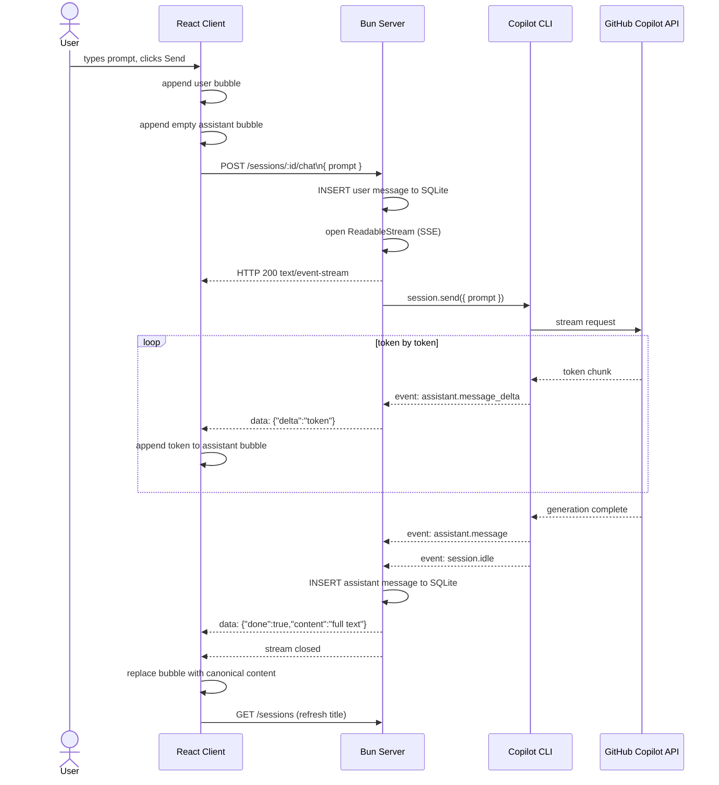

# SSE Streaming

## Changelog — Streaming Chat (SSE)

Replaced the blocking `sendAndWait` + single JSON response with a **Server-Sent Events (SSE) stream** so the UI renders the reply word-by-word as it arrives.

**Server changes (`server/`)**
- `copilot.ts` — added `streaming: true` when resuming existing sessions on boot.
- `routes/sessions.ts` — `POST /sessions/:id/chat` no longer awaits the full reply.
  - A `ReadableStream` is opened and returned immediately with `Content-Type: text/event-stream`.
  - Subscribes to the Copilot session's event emitter:
    - `assistant.message_delta` → sends `data: {"delta":"<token>"}` for every incoming token.
    - `assistant.message` → captures the final authoritative content.
    - `session.idle` → persists the full message to SQLite, sends `data: {"done":true,"content":"..."}`, then closes the stream.
    - `session.error` → sends `data: {"error":"..."}` and closes the stream.
  - User message and session title are written to SQLite **before** the stream is opened (no await needed).

**Client changes (`client/src/components/ChatTab.tsx`)**
- `send()` pre-inserts an empty assistant message bubble immediately.
- Reads `Response.body` via `ReadableStream` + `TextDecoder`, accumulating a line buffer.
- Parses each `data: ...` SSE line:
  - `{delta}` → appends token to the live assistant bubble.
  - `{done, content}` → replaces bubble content with the server's canonical text; refreshes session list.
  - `{error}` → writes the error into the bubble.

## Sequence Diagram

## REST API Endpoint

| Method | Endpoint             | Description                                                                              |
| ------ | -------------------- | ---------------------------------------------------------------------------------------- |
| `POST` | `/sessions/:id/chat` | `{ "prompt": "..." }` → SSE stream of `{delta}` / `{done, content}` / `{error}` events |

### SSE Event Types

| Event payload              | Meaning                                                        |
| -------------------------- | -------------------------------------------------------------- |
| `{"delta":"<token>"}`      | A new token chunk has arrived; append it to the current bubble |
| `{"done":true,"content":"<full text>"}` | Generation complete; replace bubble with canonical content |
| `{"error":"<message>"}`    | An error occurred during generation                            |
